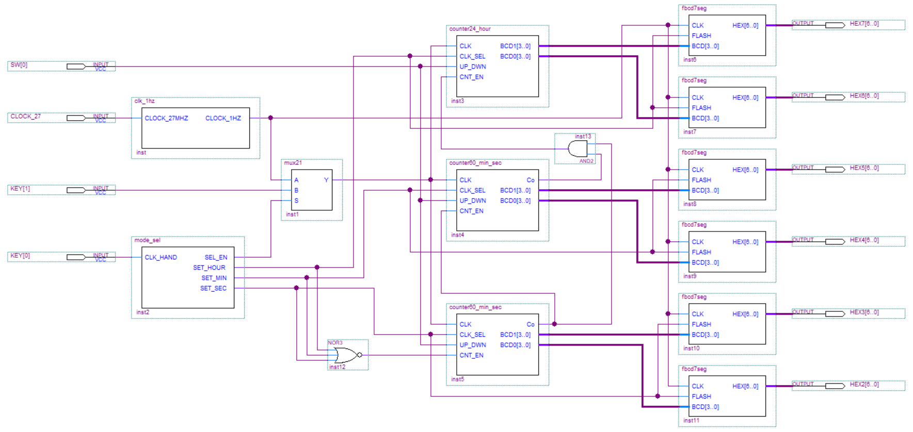

<h1 style="color:#409EFF;text-align:center;">基于VHDL的简易计时器的设计与实现</h1>

传送门：

- 本项目地址：[Gitee](https://gitee.com/snwjas/de2-electric-timer) | [GitHub](https://github.com/snwjas/DE2-Electric-Timer)
- 其他相关项目
  - DE2-VHDL计时器：[Gitee](https://gitee.com/snwjas/de2-6bit-cpu) | [GitHub](https://github.com/snwjas/DE2-6bit-CPU)
  - DE2-VHDL实验：[Gitee](https://gitee.com/snwjas/de2-labs) | [GitHub](https://github.com/snwjas/DE2-Labs)

## 前言

该设计是笔者大二时的硬件课实践作品，如今2年过去了，计算机基础和逻辑电路的知识已经忘得七七八八了，借着刚毕业还有点空闲时间，简单整理一下大学期间做过的东西，以记录自己的学习过程，也是对曾经不重视整理、总结和分享的自己的弥补和再激励。

## 设计概述

本设计简易电子计时器能顺序计时和倒计时，数据范围为1天，即00:00:00 - 23:59:59，同时具有时间设置功能，能从外部设置当前的小时数、分钟数和秒数。

本设计使用`VHDL`语言开发，开发与仿真 IDE 为`Quartus II 9.0`，在`DE2-115开发板`上测试运行。

## 设计内容

1）本设计简易电子计时器具有四种工作模式：正常计时、从外部设置当前的小时数、从外部设置当前的分钟数、从外部设置当前的秒数，同时具有可逆的计时功能；

2）在设置当前某位时间的时候，显示该时间的两个七段数码管按1Hz的频率进行闪烁，提醒当前设置的是哪个时间数，其余的数码管则处于暂停/不变/静止状态；

## 设计说明

本设计共有12个模块组成，包括：

1） 一个分频模块clk_1hz，主要使用DE2-115版的27MHz的晶振脉冲分频产生一个1Hz的时钟周期，即每秒/个时钟周期($f=\frac{1}{T}$)；

2） 一个状态发生器(模式选择)mode_sel，主要用来产生四种工作模式的控制信号和秒计数模块的计数使能控制信号；

3） 一个二选一的数据选择器模块mux21，用来选择当前输入的是手动脉冲还是1Hz的标准秒脉冲，选择信号由mode_sel进行控制；

4） 两个60进制的可逆计数模块counter60_min_sec，并带有暂停功能，分别用来对秒和分钟进行计数；

5） 一个24进制的可逆计数模块counter24_hour，并带有暂停功能，用来对小时进行计数；

6） 六个带有闪烁控制端的七段数码管译码驱动模块fbcd7seg，用来显示对应时间数的计数值，并在外部输入时间数的时候对应的数码管进行频率为1Hz的闪烁。

## 顶层设计

顶层设计图：

描述：

1）SW[0]用于切换计数器是顺序计数还是倒计时

2）KEY[0]用于切换模式，可以循环切换正常计时、设置小时数、设置分钟数和设置秒数四个模式。

3）KEY[1]用于产生一个手动脉冲，用于设置当前时间数。

## 模块设计

1）mode_sel 和 mux21

mode_sel内部维护了一个循环计数的4进制计数器（0、1、2、3），其中SEL_EN输出脚位控制mux21，当计数器为0时选择A（1Hz脉冲），其他选择B（手动脉冲）。

2）counter24_min_sec 和 counter60_hour

计时模块中，输入脚位CLK_SEL接收是正常模式还是设置模式的信号，输入脚位UP_DWN接收顺序计时还是倒计时的控制信号，脚位CNT_EN、Co为进位输入、输出信号。

3）fbcd7seg

输入脚位FLASH接收闪烁信号，高电平时激活，每个时钟周期的低电平黑灯，高电平亮灯。